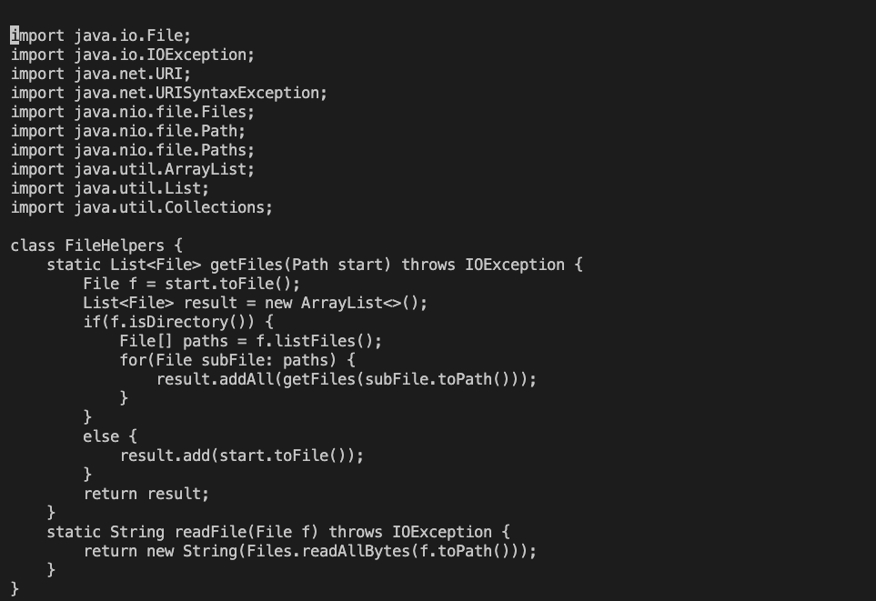

# Lab Report 4 (11/11/2022)
David Wang
## Part 1
The following sequence is for changing the name of the ```start``` parameter and its uses to ```base``` in ```DocSearchServer.java```.

Here's the sequence: ```/start<Enter>cebase<Escape>n.n.:w<Enter>```

The first part, ```/start``` searches for the string "start." Upon pressing enter, the cursor jumps to the first occurence of "start."


When the file is first opened with ```$ vim DocSearchServer.java```, the cursor is on the first character


The image above is just after typing ```/start```, which appears at the bottom of the terminal.

After pressing enter, the cursor jumps to the first occurence of start in the file, as shown below:


The next two characters in the sequence ```ce``` delete from the cursor to the end of the word (Because the cursor was on the "s" of start, the whole word got deleted) and enter insert mode.


Then, I typed ```base<Escape>```, which inserts the word "base," one letter at a time. After that, I press escape to return to visual mode.


Then, I press ```n```, which moves the cursor to the next instance of my search term, "start."


The next key is ```.```, which repeats the previous sequence of actions, which was deleting "start" and replacing it with "base."


I then typed ```n.``` again to move cursor to and replace the third and final occurence of the ```start``` parameter with "base."


Finally, typing ```:w``` and hitting enter saves the changes I just made, as seen on the bottom of the following image.


To exit out of vim, I use ```:q```. 

---

## Part 2
In this part, I will be doing the same task as above in two different ways:
* Editing the file in VSCode, using ```scp``` to get it onto the remote server, and running ```$ bash test.sh```
* Starting on the remote server and making the edit there with ```vim``` and running ```$ bash test.sh```

An assumption I am making: In both cases, the repository ```week6-skill-demo1``` will already be cloned in the local/remote server.

Here's how long it took:
* VSCode: 00:49.27
    * for this run, I noticed that it took extra time to ```ssh``` over to the remote server and ```cd``` into the repository.
* ```vim```: 00:35.84
    * the time it took between editing the file and running ```$ bash test.sh``` was much faster on this run.

Here are the two questions and my answers:

1. Which of these two styles would you prefer using if you had to work on a program that you were running remotely, and why?

I would definitely prefer the ```vim``` style, as it cuts out the time needed to ```scp```, ```ssh```, and ```cd``` into the right directory before running. In the long term, those additional steps would waste a lot of time for me. 


2. What about the project or task might factor into your decision one way or another? (If nothing would affect your decision, say so and why!)

One factor would be if I was writing large chunks of code versus making small changes, since I appreciate the feedback that the VSCode editor gives me, like letting me know about mistyping a variable or method name, or missing a bracket before the code is compiled and ran. In ```vim```, these could be more difficult to catch. But if it's just small simple changes, making them with ```vim``` is much more time-efficient.