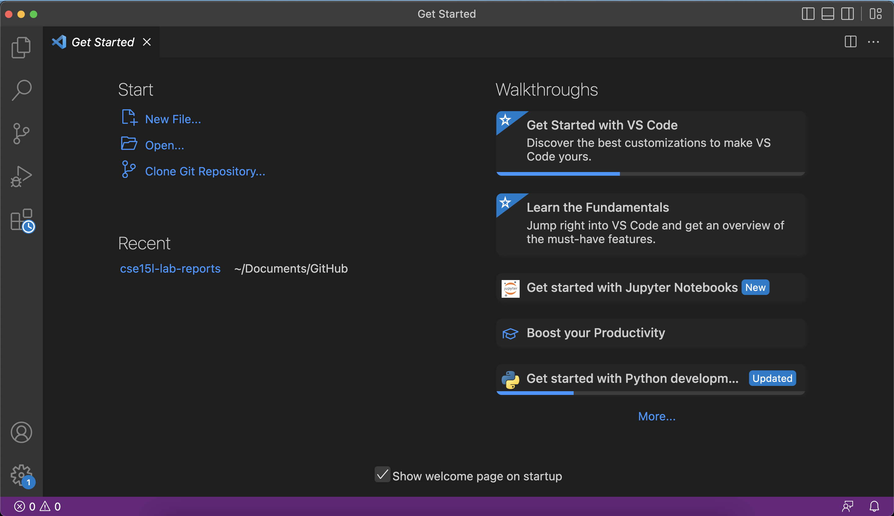
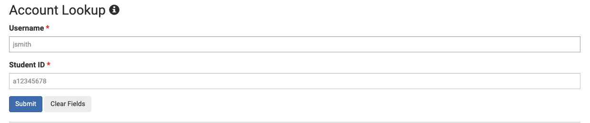
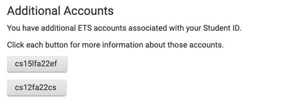
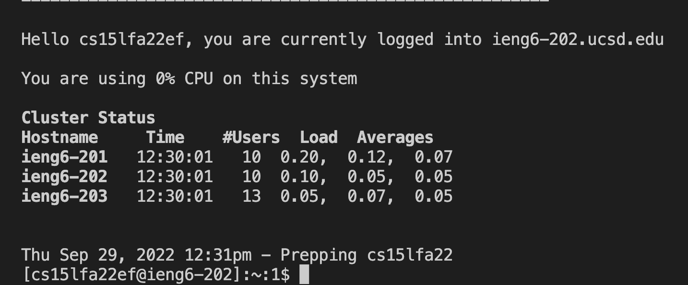
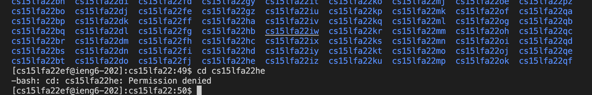
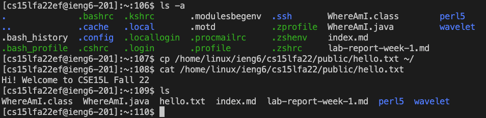
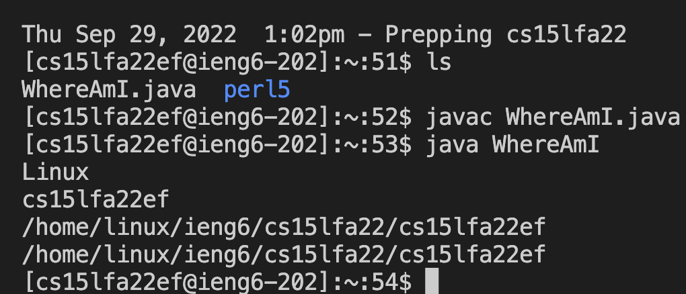
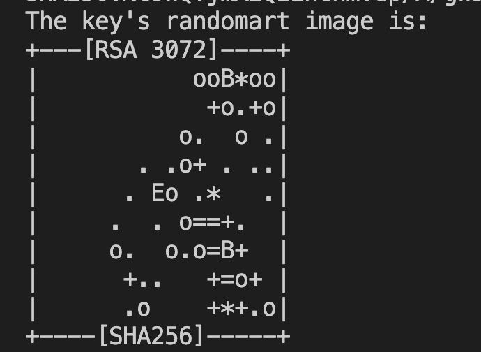
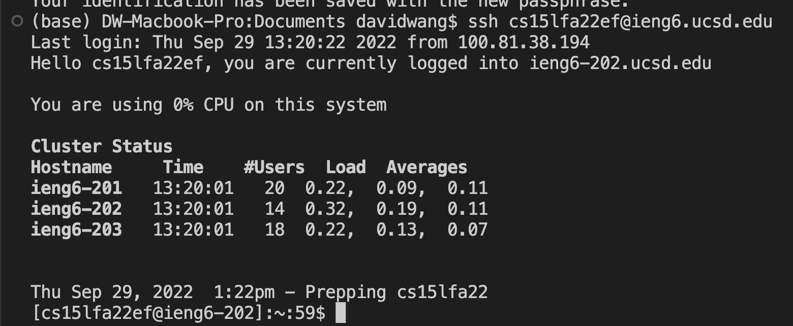
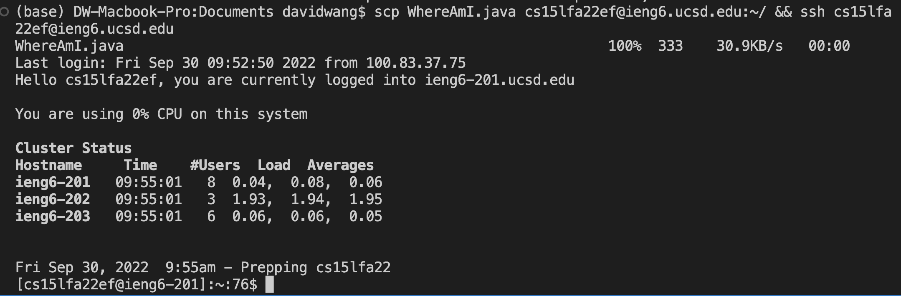

# Week 1 Lab Report (9/29/22)

These were the six goals for today:
* Install VS Code
* Remotely connect to UCSD computers with ssh
* Navigate in those computers with terminal commands
* Copy files over with scp
* Set up an ssh key to make my life easier
* Learn other ways of making my life easier

---

## Installing VS Code
I already had VS Code installed before this class, and if I remember correctly, I just downloaded the application from the [website](https://code.visualstudio.com/) and ran it.



---
## Remotely Connecting
Before anything else, I had to access my CSE 15L account that I would use to login to the remote computers. I first looked up my account [here](https://sdacs.ucsd.edu/~icc/index.php) by entering my username and PID.



Upon clicking submit, I was able to see my various account names.



After clicking on my ```cs15lfa22ef``` account, there was a link to reset my password. I entered my old password and my new password.

(Note: more detailed instructions, courtesy of UCSD, can be found [here](https://docs.google.com/document/d/1hs7CyQeh-MdUfM9uv99i8tqfneos6Y8bDU0uhn1wqho/edit))

To start off the actual login process, I typed in the command

```$ ssh cs15lfa22ef@ieng6.ucsd.edu```
(cs15lfa22ef being my username for the class).
I was then prompted for a password, which I set up previously. Upon correctly entering my password, I was logged in.



---
## Learning to Navigate
Using terminal commmands in this new environment was exactly the same as on my computer.

I navigated to the directory 
```/home/linux/ieng6/cs15lfa22/```, used ls to see all the available users, and tried to ```cd``` into a random person’s account which (understandably) denied me entry.



Here are some other commands I ran:
* ```$ ls -a``` showed all files in the current directory, including hidden files
* ```$ cp /home/linux/ieng6/cs15lfa22/public/hello.txt ~``` copied a file from the listed directory to my home directory (```/home/linux/ieng6/cs15lfa22/cs15lfa22ef```)
* ```$ cat /home/linux/ieng6/cs15lfa22/public/hello.txt``` printed the contents of the file ```hello.txt```
* ```$ ls``` simply helped me verify that the file ```hello.txt``` was actually copied over.



---
## Copying files with scp
Ok, half way done.
First, I had to choose what I wanted to transfer over. I created a file named  ```WhereAmI.java``` filled with the following code:
```
class WhereAmI {
  public static void main(String[] args) {
    System.out.println(System.getProperty("os.name"));
    System.out.println(System.getProperty("user.name"));
    System.out.println(System.getProperty("user.home"));
    System.out.println(System.getProperty("user.dir"));
  }
}
```
What this program does is it prints out basic information about where you are.

Next, I had to actually copy it over to the other computer, a tasked I accomplished with ```$ scp WhereAmI.java cs15lfa22ef@ieng6.ucsd.edu:~/```
> Note to my future self: It's not working because you forgot the ```:~/``` at the end of the command. Be better.

This command prompted me for my password once again after which the file was copied over successfully.


I then logged on remotely again using ```$ ssh cs15lfa22ef@ieng6.ucsd.edu```, typed in my password, and compliled/ran the file.



---
## Setting up ssh key
If you've been following up until now, you may have noticed that I have needed to go through the tedious process of typing in my password everytime I want to4533 interact with the remote computer (made more annoying by my immeasurable ability to never type a password correctly on the first try). 

An ssh key fixes this, by placing a public key on the remote computer and a private key on mine. This allows the login process to use the two corresponding files instead of a physical password.

To start this process, I used the command ```$ ssh-keygen``` This prompted a file path and a passphrase (both of which can be left blank). Upon generation, a nice little rewarding picture was displayed.


Now, I had both the public and private keys on my client, but I still needed to copy the public key onto the server, so I could use it to login. This was accomplished with another ```$ scp``` command. After one last password entry, I was done. 

My next attempt to ```$ ssh``` yielded great success in that I was able to login without a password prompt.



---
## Further Optimization
I can make my life even easier by only typing the important commands once, and using the up-down arrow keys after for navigating. Furthermore, I can type multiple commands in a single line which speeds up the proccess even more (like copying a file over and logging into the server at once).



---
## Conclusion
It was a pretty fun lab overall, and I learned a lot.


